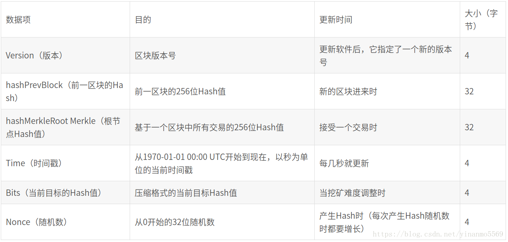
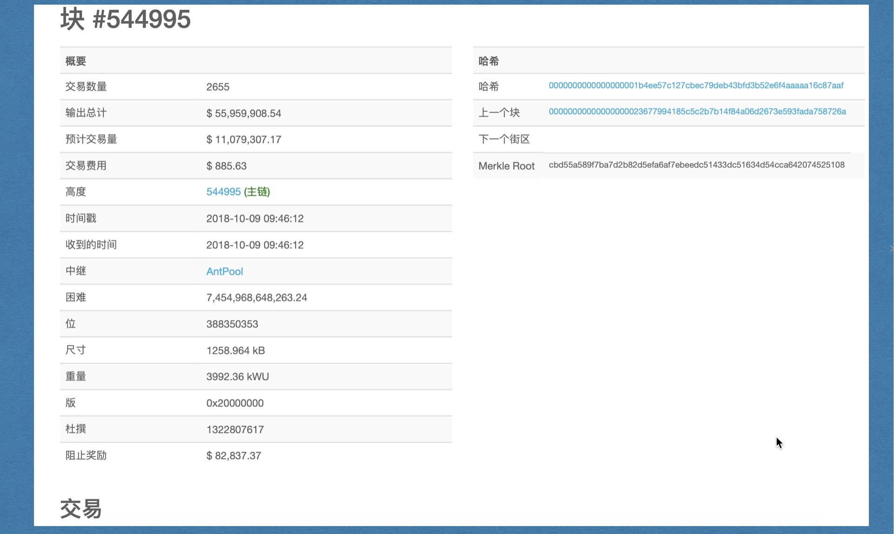
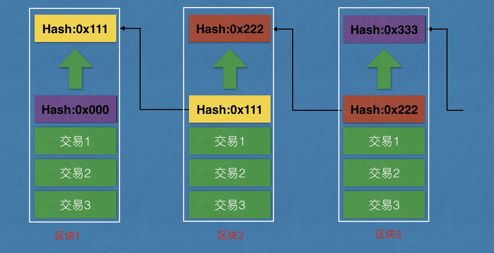
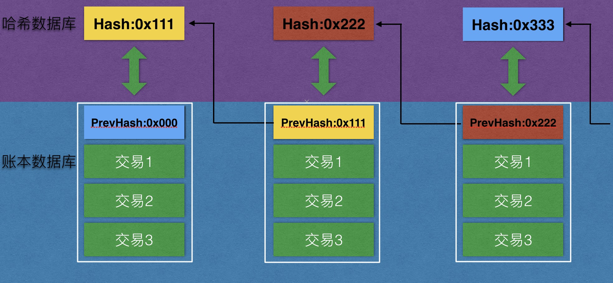
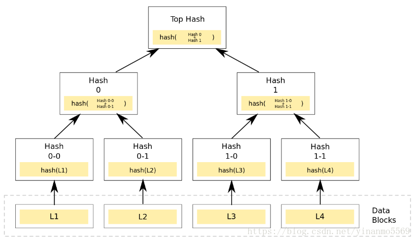
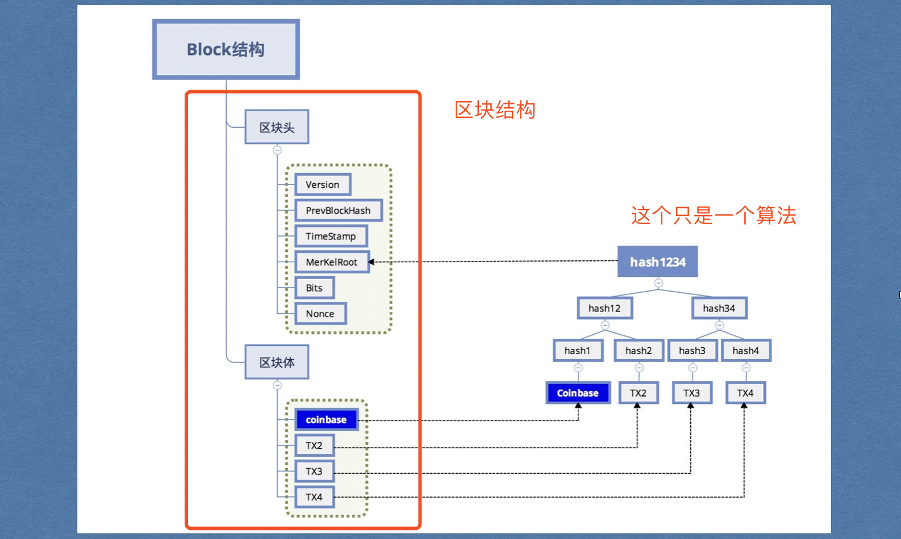
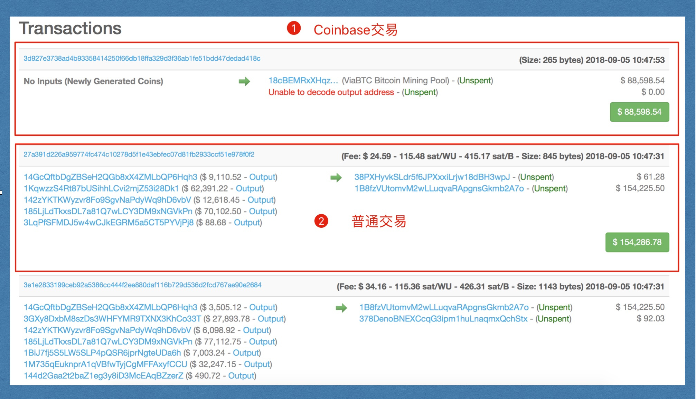
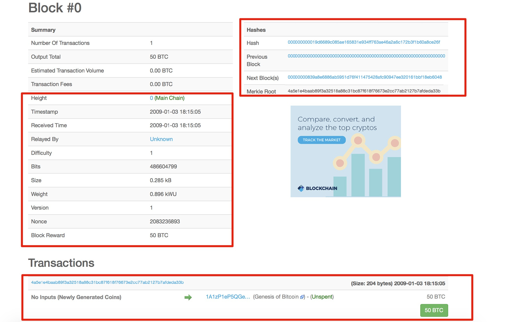

## 区块整体结构

每个Block分为两部分：区块头（Block Header）和区块体（ Block）

[https://btc.com](https://btc.com/)网站上查询区块

### 区块头（Block Header）

一个完整的区块头结构主要包含三组元数据：

- 版本号和上一个区块的hash:用于连接前面的区块、索引自父区块哈希值的数据。
- 当前区块的hash:能够总结并快速归纳校验区块中所有交易数据的Merkle（默克尔）树根数据
- 时间戳、挖矿难度、Nonce（随机数，用于工作量证明算法的计数器）

#### 根节点哈希值
这里说的根节点哈希值不是本区块的hash值，是根据交易信息计算出来的Merkle Root 值。

区块不存储hash值，节点接收区块后独立计算并存储在本地
之前我们看到的是这样的，

可实际上是这样的:

这样做的目的还是为了能够检索方便，如果不用哈希数据库，那么查看一个区块就要通过回推的办法遍历整个区块链。如果有哈希数据库的话就能够通过快速定位一个区块。

#### Merkle树结构
Merkle树的数据结构存放所有叶子节点的值，并以此为基础生成一个统一的哈希值。Merkle的叶子节点存储的是数据信息的哈希值，非叶子节点的存储是对其下面所有叶子节点的组合进行哈希计算后得出的哈希值。区块中任意一个数据的变更都会导致Merkle树结构发生变化，在交易信息验证对比的过程中，Merkle树结构能够大大减少数据的计算量，毕竟，我们只需验证Merkle树结构生成的统一哈希值就可以了。

#### 时间戳

区块链中的时间戳从区块生成那一刻起就存在于区块中，它对应的是每一次交易记录的认证，证明交易记录的真实性。

### 区块体（Transactions）

#### Coinbase交易

第一条交易，挖矿奖励矿工

### 普通转账交易

每笔交易包括付款方、收款方、付款金额、手续费等等。

主要是包含交易数据（Transaction，TX）． 

Transactions包括一个input和多个output．并且输入和输出相等：

**input satoshi=output satoshi**

已确认的交易（或者说已经花出去的钱）被称为Transaction identifiers（TXIDs），未确认的被称为Unspent Transaction Outputs（UTXOs）

## 创世块信息

