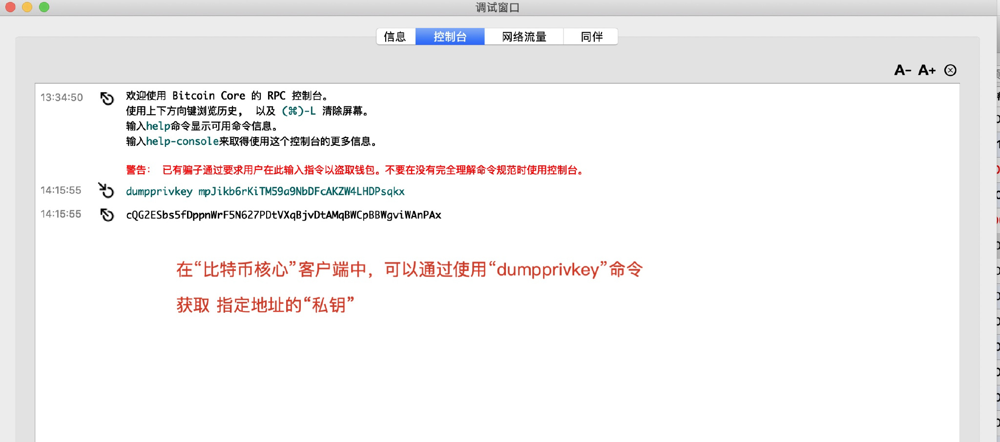
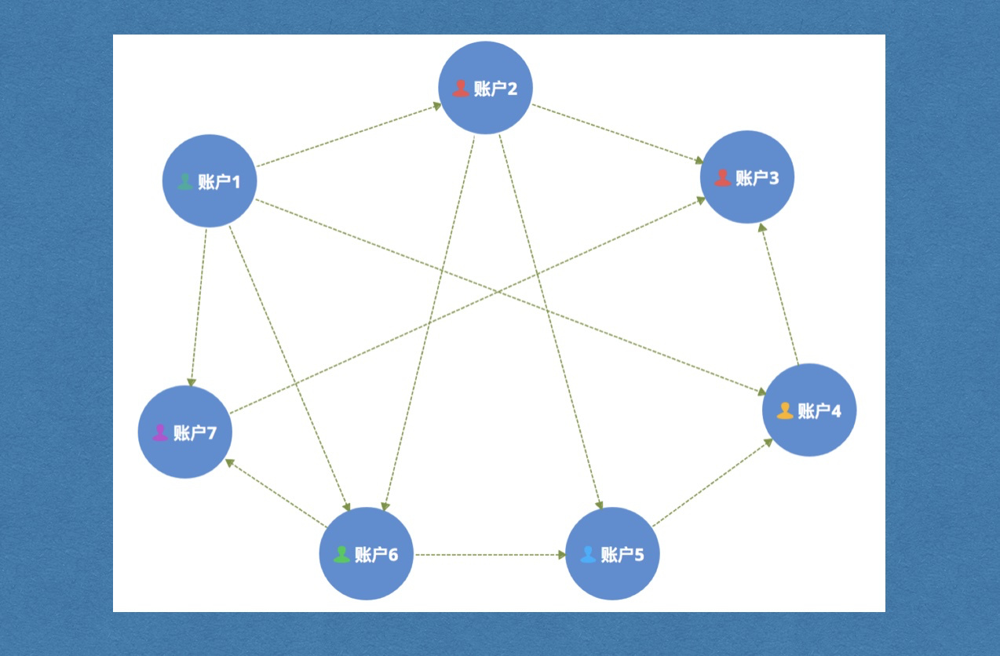

## 钱包

比特币核心钱包（Bitcoin Core）是官方发布的用于管理比特币私钥的客户端。拥有比特币地址的私钥代表拥有对应的比特币的控制权，私钥一旦丢失将无法恢复，因此，备份好钱包非常重要。

钱包客户端的钱包文件就是存储比特币私钥的数据库。私钥和公钥都 存放在比特币钱包的wallet.dat文件中。在多个地方安全地保管钱包文件可防止意外情况发生的时候恢复比特币。

比特币钱包里面就是保护N个公钥/地址对，每一个地址都有自己的私钥，wallet.dat就是私钥的集合。

地址是无法反推回私钥的，这里能取到私钥是因为wallet.dat中存储了私钥，通过地址访问了私钥，而不是通过地址生成的。

```shell
//钱包文件位置
Windows 7/8 - C:\Users\{username}\AppData\Roaming\Bitcoin\wallet.dat
Mac OS X ~/Library/Application Support/Bitcoin/wallet.dat
Linux ~/.bitcoin/wallet.dat
```

```shell
//通过访问钱包获得私钥
dumpprivkey 钱包地址
```




## 算力

算力（也称哈希率）是比特币网络处理能力的度量单位。计算哈希函数输出的速度。

在通过“挖矿”得到比特币的过程中，我们需要找到其相应的解m，而对于任何一个**六十四位的哈希值**，要找到其解m，都没有固定算法，只能靠计算机随机的hash碰撞，而一个挖矿机每秒钟能做多少次hash碰撞，就是其“算力”的代表，单位写成hash/s,这就是所谓工作量证明机制POW(Proof Of Work)。

当网络达到10Th/s的哈希率时，意味着它可以每秒进行10万亿次计算。

1 TH / s =每秒1,000,000,000,000次哈希。一万亿次运算。


**六十四位的哈希值是什么**

六十四位的哈希值=32个字节=32*8个比特=256位比特。

*SHA256* 算法的哈希值大小为 *256* 位。


## 节点（node）

每一个运行挖矿软件的人变成为一个区块链网络的节点。

- 轻节点
- 全节点（强调是全指的是账本），查看当前总容量




## 账本

所有交易信息的集合，使用[levelDB](http://www.cnblogs.com/chenny7/p/4026447.html)数据库，每个节点都同步一个账本。


## 比特币地址

### 地址规则

对随机字符串进行哈希，生成32字节的私钥


### 生成流程


