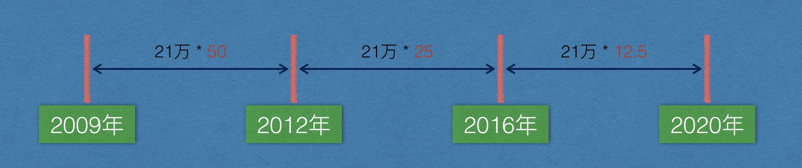

## 1. 出块时间

10分钟，系统根据当前出块时间动态调整难度值（每2016个块调整一次，2周），使得时间稳定在10分钟左右。包括同步时间，校验时间，计算时间等。

如果不控制10分钟产生一个区块，那么比特币就不能保证稳定的发行，秩序就会混乱！

安全性和适用性的权衡，太快容易同时出块（分叉，后面介绍），需要频繁的处理，太慢影响使用体验。

## 2. 出块奖励

最初50BTC，每21万个块奖励减半，10分钟，21 万 * 10分钟/60 / 24小时/ 365 = 4年，当前奖励为12.5BTC



## 3. 比特币总量

2100万，2140年挖完（snappy截图对照）

```go
func main() {

    total := 0.0        // 比特币总数
    rewardCount := 50.0 // 奖励 BTC 的数量
    blockInterval := 21 // 区块间隔，单位万
    reduceCount := 0 //减半次数
    for rewardCount > 0 {
        // 在区块间隔内，统一奖励（生成）rewardCount 个比特币
        sum := float64(blockInterval) * rewardCount
        total += sum

        // 每挖到 21w 个矿，奖励减半
        rewardCount *= 0.5
        reduceCount++
    }

    fmt.Printf("比特币总数：%f 万,衰减次数：%d\n", total, reduceCount)
}
```

reduce * 4 + 2008 = 2140

## 4. 区块容量

考虑同步效率

1M大约容纳4000条交易：

1M / 每笔交易的字节 = 交易数（1024 * 1024 / 223 = 4200)

## 5. 每秒成交量

4200 / 600s = 7笔/秒

## 6. 单位

1BTC = 10**8sat(聪)