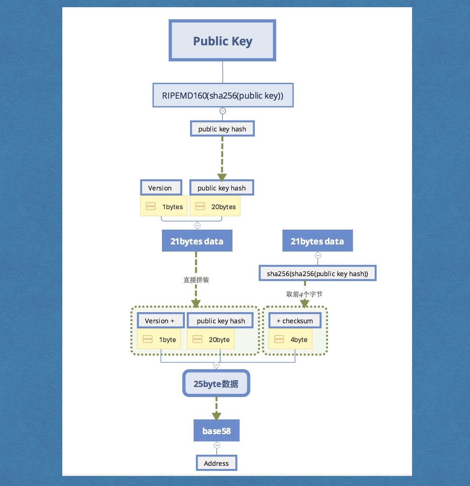
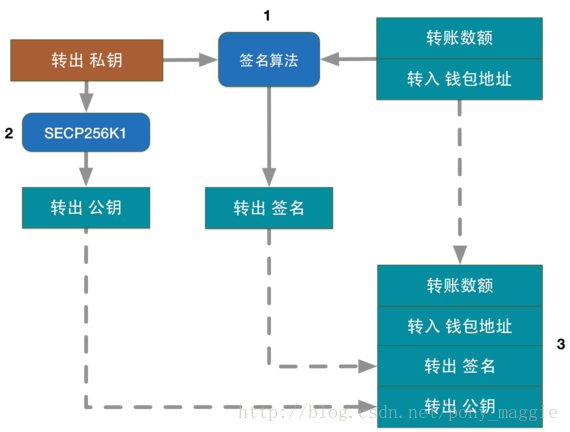

## 钱包地址生成

1.首先使用随机数发生器生成一个『私钥』。一般来说这是一个256bits的数，拥有了这串数字就可以对相应『钱包地址』中的比特币进行操作，所以必须被安全地保存起来。
2.『私钥』经过SECP256K1算法处理生成了『公钥』。SECP256K1是一种椭圆曲线算法，通过一个已知『私钥』时可以算得『公钥』，而『公钥』已知时却无法反向计算出『私钥』。这是保障比特币安全的算法基础。
3.同SHA256一样，RIPEMD160也是一种Hash算法，由『公钥』可以计算得到『公钥哈希』，而反过来是行不通的。
4.将一个字节的地址版本号连接到『公钥哈希』头部（对于比特币网络的pubkey地址，这一字节为“0”），然后对其进行两次SHA256运算，将结果的前4字节作为『公钥哈希』的校验值，连接在其尾部。
5.将上一步结果使用BASE58进行编码(比特币定制版本)，就得到了『钱包地址』。 
比如, 1A1zP1eP5QGefi2DMPTfTL5SLmv7DivfNa

## 私钥、公钥、钱包地址间的关系

在上述的五个步骤里只有“BASE58编码”有相应的可逆算法（“BASE58解码”），其他算法都是不可逆的，所以这些数据之间的关系可以表示为：

可以看到：

通过『私钥』可以得到上述计算过程中所有的值。 

『公钥哈希』和『钱包地址』可以通过互逆运算进行转换，所以它们是等价的。

## 使用『私钥』对交易进行签名

比特币钱包间的转账是通过交易（Transaction）实现的。交易数据是由转出钱包『私钥』的所有者生成，也就是说有了『私钥』就可以花费该钱包的比特币余额。生成交易的过程如下：

1. 交易的原始数据包括“转账数额”和“转入钱包地址”，但是仅有这些是不够的，因为无法证明交易的生成者对“转出钱包地址”余额有动用的权利。所以需要用『私钥』对原始数据进行签名。
2. 生成“转出钱包公钥”，这一过程与生成『钱包地址』的第2步是一样的。
3. 将“转出签名”和“转出公钥”添加到原始交易数据中，生成了正式的交易数据，这样它就可以被广播到比特币网络进行转账了。

## 使用『公钥』对签名进行验证

交易数据被广播到比特币网络后，节点会对这个交易数据进行检验，其中就包括对签名的校验。如果校验正确，那么这笔余额就成功地从“转出钱包”转移到“转入钱包”了。

## 小结

如果一个『钱包地址』从未曾发送余额到其他『钱包地址』，那么它的『公钥』是不会暴露在比特币网络上的。而公钥生成算法（SECP256K1）是不可逆的，即使『公钥』暴露，也很难对『私钥』的安全性造成影响（难易取决于『私钥』的生成算法）。 
『私钥』用来生成『公钥』和『钱包地址』，也用来对交易进行签名。拥有了『私钥』就是拥有了对这个钱包余额的一切操作权力。所以，保护『私钥』是所有比特币钱包应用最基本也是最重要的功能。 

