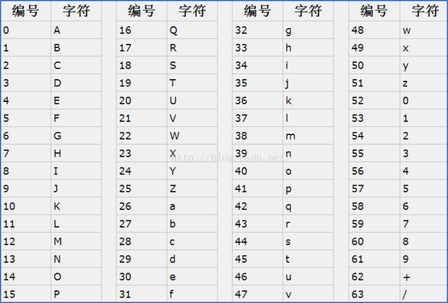
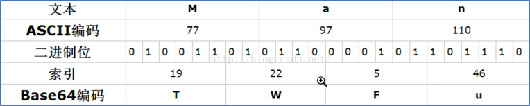
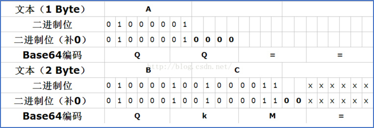

在区块中，编码的主要作用就是进行**网络传输、生成地址**。

## Base64

Base64编码，是我们程序开发中经常使用到的编码方法。因为base64编码的字符串，更适合不同平台、不同语言的传输（一个字符可能其他的系统没有）。它是一种基于用64个可打印字符来表示二进制数据的表示方法。它通常用作存储、传输一些二进制数据编码方法，一句：将二进制数据文本化（转成ASCII）。

### 作用

由于某些系统中只能使用ASCII字符。Base64就是用来将非ASCII字符的数据转换成ASCII字符的一种方法。

###  原理

Base64编码要求把3个8位字节（3*8=24）转化为4个6位的字节（4*6=24），之后在6位的前面补两个0，形成8位一个字节的形式。 如果剩下的字符不足3个字节，则用0填充，输出字符使用'='，因此编码后输出的文本末尾可能会出现1或2个'=’。

为了保证所输出的编码位可读字符，Base64制定了一个编码表，以便进行统一转换。编码表的大小为2^6=64，这也是Base64名称的由来。

### Base64编码表



恰好三个字节情况：



不足三个字节情况：



### 特点

- base64就是一种基于64个可打印字符来表示二进制数据的方法。
- Z（26）、a-z（26）、0-9（10）、+/（2）：共计64个字符。
- 编码后便于传输，尤其是不可见字符或特殊字符，对端接收后解码即可复原。
- base64只是编码，并不具有加密作用。

### 代码

```go
func main() {
	input := []byte("北京go一期有一群神秘的大佬，他们家里有矿！")

	// 演示base64编码
	encodeString := base64.StdEncoding.EncodeToString(input)
	fmt.Println(encodeString)

	// 对上面的编码结果进行base64解码
	decodeBytes, err := base64.StdEncoding.DecodeString(encodeString)
	if err != nil {
		log.Fatalln(err)
	}
	fmt.Println(string(decodeBytes))
	
	// 如果要用在url中，需要使用URLEncoding
	uEnc := base64.URLEncoding.EncodeToString([]byte(input))
	fmt.Println(uEnc)

	uDec, err := base64.URLEncoding.DecodeString(uEnc)
	if err != nil {
		log.Fatalln(err)
	}
	fmt.Println(string(uDec))
}
```

## Base58（比特币生成地址）

在base64字符中去掉6种容易混淆的字符

- 0: number zero
- O: capital o
- l: lower L
- I: capital i
- +
- /

### 为什么base58

使用了58个字符（一种Base58数字系统）和校验码，提高了可读性、避免歧义并有效防止了在地址转录和输入中产生 的错误。